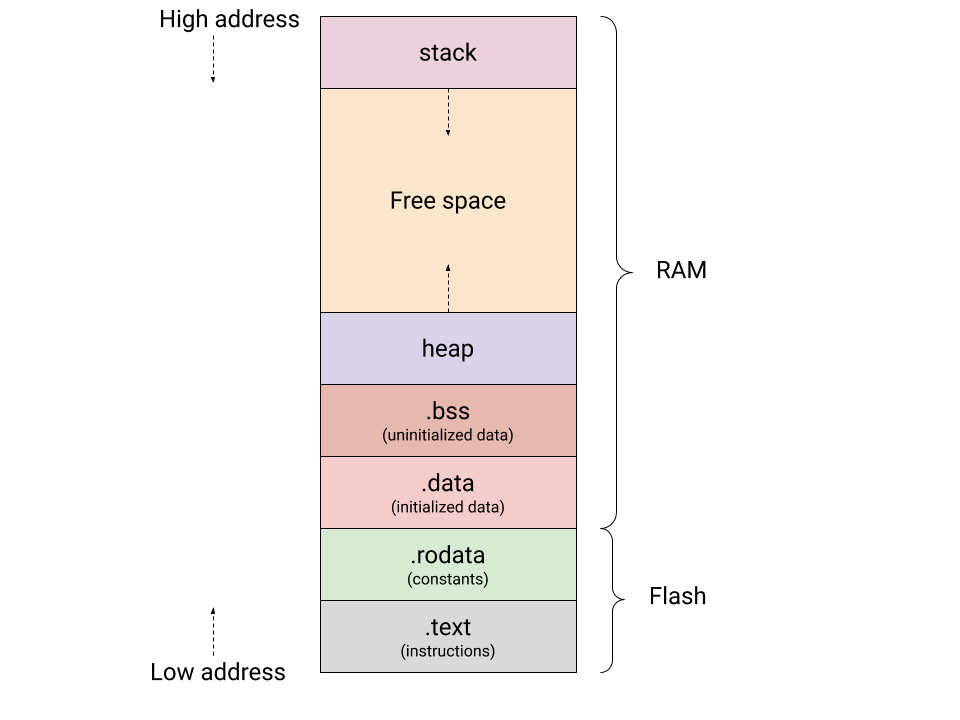

## Место C в стеке абстракций

C — компилируемый язык, который сидит между ассемблером и высокоуровневыми языками.
Компилятор знает о платформе, но код по-прежнему близок к железу: нет сборщика мусора,
нет runtime-проверок, размеры типов зависят от архитектуры.

Применяется там, где важны контроль над памятью и предсказуемая производительность:
ядро ОС, драйверы, embedded код, компиляторы, базы данных, сетевой стек.

## Поведение, которое стандарт не фиксирует

Стандарт C делит неоднозначные ситуации на три класса.

**Implementation-defined** — поведение задаёт платформа, но оно задокументировано.
Например, представление знакового числа (two's complement или sign-magnitude),
знаковость `char`.

**Unspecified** — есть несколько корректных вариантов, компилятор выбирает любой.
Например, порядок вычисления аргументов при вызове `f(g(), h())`.

**Undefined behavior (UB)** — компилятор вправе делать что угодно, в том числе
убрать проверку вообще. Примеры: выход за границу массива, разыменование NULL,
signed overflow.

```c
INT_MAX + 1;  // UB — компилятор может выбросить весь код, который это вызвал
i < i + 1;    // UB если i == INT_MAX — компилятор вправе превратить это в true
```

Флаги для поиска UB:

```bash
gcc -fsanitize=undefined myprog.c  # динамическая проверка во время работы
gcc -ftrapv myprog.c               # abort() при signed overflow
```

## Целочисленные типы

Стандарт задаёт только нижнюю границу ширины:

```
char      — CHAR_BIT бит (обычно 8)
short     — не менее 16 бит
int       — не менее 16 бит
long      — не менее 32 бит
long long — не менее 64 бит
```

На практике размеры в байтах зависят от платформы:

```
Тип        Atmel AVR   32-bit   Win64   Linux/amd64
char           1          1       1          1
short          2          2       2          2
int            2          4       4          4
long           4          4       4          8   ← здесь расходятся
long long      —          8       8          8
```

Тип `char` — знаковый или беззнаковый зависит от платформы и компилятора.
Для арифметики всегда используй `signed char` или `unsigned char` явно.
`short`, `int`, `long`, `long long` без `unsigned` — всегда знаковые.

Для типов с фиксированным размером используй `<stdint.h>`:

```c
#include <stdint.h>

int8_t, int16_t, int32_t, int64_t
uint8_t, uint16_t, uint32_t, uint64_t
intptr_t, uintptr_t  // целое того же размера, что указатель
```

Пределы типов — в `<limits.h>`: `INT_MIN`, `INT_MAX`, `UINT_MAX`, `LLONG_MAX`, …

## Константы и их типы

Десятичная константа получает первый подходящий тип из списка
`int → long → long long`.
Шестнадцатеричная и восьмеричная — из списка
`int → uint → long → ulong → llong → ullong`.

```c
10          // int
2147483648  // на gcc/amd64 — long (не влезает в int)
0x80000000  // unsigned int (то же число, другой тип!)
```

Суффиксы принудительно задают тип:

```c
0U    // unsigned int
0L    // long
0UL   // unsigned long
0LL   // long long
0ULL  // unsigned long long
```

## Арифметика и integer promotion

Операнды типа `char` и `short` перед арифметикой расширяются до `int`
(integer promotion).

```c
unsigned char x = 255, y = 1;
int res = x + y;  // res == 256, не 0 — оба расширились до int перед сложением
```

Беззнаковое переполнение — хорошо определено, происходит по модулю 2^N:

```c
UINT_MAX + 1;  // всегда 0
```

Знаковое переполнение — UB. Компилятор не обязан его симулировать:

```c
INT_MAX + 1;  // UB, не -2147483648
```

## Что компилятор делает с кодом

Посмотреть ассемблерный выход:

```bash
gcc -O0 -S file.c -o file.s  # ассемблерный листинг (-O0 отключает оптимизации)
gcc -O0 -g file.c -o prog    # с отладочными символами
gcc -E file.c                # только препроцессор
gcc -c file.c -o file.o      # объектный файл (без линковки)
objdump -d file.o            # дизассемблировать объектник
```

Условный переход — это `cmp` + `jle`/`jg`/`je`:

```c
int sign(int x) {
    if (x > 0) {
        return 1;
    } else {
        return -1;
    }
}
```

```x86asm
sign:
    cmp  edi, 0
    jle  .else
    mov  eax, 1
    ret
.else:
    mov  eax, -1
    ret
```

Цикл `for` — это `cmp` + обратный `jmp`:

```c
int s = 0;
for (int i = 0; i < n; i++) {
    s += i;
}
```

```x86asm
    xor eax, eax  ; s = 0
    xor ecx, ecx  ; i = 0
.loop:
    cmp ecx, edi  ; i < n?
    jge .done
    add eax, ecx  ; s += i
    inc ecx
    jmp .loop
.done:
    ret
```

## Соглашения о вызовах (System V AMD64 ABI)

На Linux/x86-64:
* аргументы: `rdi, rsi, rdx, rcx, r8, r9`, остальные в стек;
* возврат: `rax`;
* callee-saved: `rbx, rbp, r12–r15`;
* `call foo` = `push адреса возврата` + `jmp foo`;
* при входе в функцию компилятор делает пролог:

```x86asm
push rbp
mov rbp, rsp
```

```c
int add_two(int a, int b) {
    return a + b;
}
```

```x86asm
add_two:
    mov eax, edi  ; a приехал в edi
    add eax, esi  ; b приехал в esi
    ret
```

## Переменные и классы хранения

```c
int x;  // глобальная — статическое хранение, инициализирована нулём

void foo(void) {
    int y;           // автоматическая — стек, содержимое не определено
    static int z;    // статическая локальная — живёт всю программу
    register int t;  // подсказка компилятору, нельзя брать адрес
}

extern int ext;  // объявление без определения (определение — в другом .c)
```

`static` на уровне файла ограничивает видимость текущей единицей трансляции:

```c
// видны линкеру
int var;
int foo(int a) {}

// не видны
static int var2;
static void bar(void) {}
```

## Функции

В C объявление без параметров — не то же самое, что `(void)`:

```c
int foo();      // принимает ЛЮБОЕ количество аргументов (устаревший стиль)
int bar(void);  // принимает НОЛЬ аргументов
int baz(int);   // принимает один int
```

## Сборка и линковка

```
foo.c → [компилятор] → foo.o ─┐
bar.c → [компилятор] → bar.o ─┤→ [линкер] → программа
baz.c → [компилятор] → baz.o ─┘
```

Линкер сопоставляет неопределённые символы из одних `.o` с определёнными из других.
Если символ объявлен в `.c`, но не определён — linker error.
Если определён в двух местах — тоже ошибка.

## Препроцессор

Препроцессор работает с текстом до компилятора — он не знает типов и не делает
проверок. Это одновременно сила и источник трудноуловимых ошибок.

Защита от двойного включения:

```c
#pragma once  // не стандарт, но поддерживается везде

// классический вариант:
#ifndef FOO_H
#define FOO_H
// ...
#endif
```

Макросы-константы — надо оборачивать в скобки, иначе сломается приоритет:

```c
#define MYVAL 100 + 500

int f() {
    return MYVAL * 10;
}
// раскрывается в: 100 + 500 * 10 == 5100, а не 6000!

#define MYVAL (100 + 500)  // правильно
```

Макросы-функции — каждый аргумент тоже надо оборачивать:

```c
#define SQ_BAD(x)  x * x
#define SQ_GOOD(x) ((x) * (x))

int a = 3;
SQ_BAD(a + 1)   // раскрывается в: a + 1 * a + 1 == 7, а не 16
SQ_GOOD(a + 1)  // раскрывается в: ((a+1) * (a+1)) == 16
```

Но даже `SQ_GOOD(i++)` — UB, потому что `i` вычисляется дважды.
Для функций используй `static inline` — тип проверяется, раскрытие единственное:

```c
static inline int sq(int x) {
    return x * x;
}
```

## Структуры и выравнивание

Компилятор вставляет padding между полями, чтобы каждое поле лежало
по выровненному адресу. Размер поля = его выравнивание (не более 8).
Размер всей структуры кратен её выравниванию.

```c
struct bad {
    char b;       // offset 0
                  // 3 байта padding
    int i;        // offset 4
    long long l;  // offset 8
    char c;       // offset 16
                  // 7 байт padding
};
// sizeof == 24, alignof == 8
```

Если переставить поля от большого к маленькому — padding уменьшается:

```c
struct good {
    long long l;  // offset 0
    int i;        // offset 8
    char b;       // offset 12
    char c;       // offset 13
                  // 2 байта padding
};
// sizeof == 16, alignof == 8
```

`__attribute__((packed))` убирает весь padding — полезно для сетевых протоколов
и бинарных форматов, но медленно и опасно на архитектурах без unaligned access.

## Секции виртуальной памяти



```c
/* .text — машинный код функций, rx */
int add(int a, int b) { return a + b; }
```

```c
/* .rodata — строковые литералы, const-глобалы, r */
const char *msg = "hello";  // указатель в .rodata
const int limit = 100;      // тоже .rodata

msg[0] = 'H';  // SEGFAULT — mapped read-only
```

```c
/* .data — глобалы с ненулевым инициализатором, rw */
int counter = 1;
char buf[] = "mutable";  // КОПИЯ строки, можно менять

buf[0] = 'M';  // OK
```

```c
/* .bss — глобалы без инициализатора или = 0, rw
 * в исполняемом файле не занимают места — ОС обнуляет */
int g;              // == 0
char big[1 << 20];  // 1 МБ в бинарнике = 0 байт
```

```c
/* stack — локальные переменные, растёт вниз */
void foo(void) {
    int x = 7;
    char s[] = "hello";  // КОПИЯ строки на стеке, writable
    char buf[64];        // неинициализировано — мусор

    s[0] = 'H';  // OK
}
// x, s, buf уничтожены при выходе из foo
```

```c
/* heap — malloc/calloc/realloc, живёт до free() */
char *p = malloc(64);
strcpy(p, "heap data");
p[0] = 'H';  // OK
free(p);
```

## Строки

Строка в C — это `char[]`, оканчивающийся нулевым байтом `'\0'`. Длина не хранится.

Строковый литерал `"hello"` компилятор кладёт в секцию `.rodata` — read-only.

```c
char arr[] = "hello\n";      // копия на стеке — writable
arr[0] = 'H';                // OK

const char *ptr = "world\n"; // указатель в .rodata — read-only
ptr[0] = 'W';                // SEGFAULT
```

В ассемблерном листинге видна разница: для `arr[]` компилятор генерирует
серию `movb` на стек, для `ptr` — метку `.LC0` в секции `.rodata` и `lea rax, .LC0`.

```c
// реализация strlen через указатели (без индексирования)
size_t mystrlen(const char *s) {
    const char *p = s;
    while (*p) {
        ++p;
    }
    return (size_t)(p - s);
}
```

## printf и scanf

```c
int printf(const char *restrict format, ...);
int scanf(const char *restrict format, ...);
```

Основные спецификаторы:

```
%d   — int              %u   — unsigned int
%hd  — short            %hu  — unsigned short
%ld  — long             %lu  — unsigned long
%lld — long long        %llu — unsigned long long
%x   — unsigned hex     %o   — unsigned octal
%s   — char*            %zu  — size_t
```

В `printf` аргументы меньше `int` расширяются автоматически (integer promotion),
поэтому `%hd` для `short` технически корректен.

В `scanf` мы передаём указатель — размер критичен: `scanf("%d", &ll)` для
`long long` запишет только 4 байта в первую половину переменной, остальное мусор.

```c
short s;
scanf("%hd", &s);  // правильно

long long ll;
scanf("%lld", &ll);  // правильно

char buf[100];
scanf("%99s", buf);  // ВСЕГДА ограничивай длину строки — иначе buffer overflow
```

`scanf` возвращает количество успешно считанных полей. При конце ввода — `EOF`.

```c
int result = scanf("%d", &x);
if (result == EOF) { /* конец ввода */ }
if (result != 1)   { /* ошибка формата */ }
```

## Переполнение (задача satsum)

Задача: насыщающее сложение двух `uint32_t` — если есть overflow, вернуть максимум.
Без 64-битных типов, без хардкода константы размера.

Ключевое наблюдение: при беззнаковом переполнении сумма «обернулась» и стала
меньше каждого слагаемого.

```c
uint32_t satsum(uint32_t v1, uint32_t v2) {
    uint32_t res = v1 + v2;
    if (res < v1) {
        res = ~(uint32_t)0;  // ~0 == UINT32_MAX для любого размера
    }
    return res;
}
```

Для знакового переполнения есть GCC-расширение:

```c
bool __builtin_add_overflow(type1 a, type2 b, type3 *res);
bool __builtin_sub_overflow(type1 a, type2 b, type3 *res);
bool __builtin_mul_overflow(type1 a, type2 b, type3 *res);
```

```c
long long x = INT64_MAX, y = 1, result;
if (__builtin_add_overflow(x, y, &result)) {
    // overflow — result содержит wrapping-значение, но мы знаем что оно неверно
}
```

## Строки через указатели (задача mystrcmp)

Задача: реализовать `strcmp` без оператора `[]`, только через указатели.

Правило стандарта: `strcmp` сравнивает символы как `unsigned char`. Если не
приводить — знаковые `char` дадут неверный порядок для байт со значением > 127.

```c
int mystrcmp(const char *s1, const char *s2) {
    while (*s1 && *s1 == *s2) {
        ++s1;
        ++s2;
    }
    return *(const unsigned char *)s1 - *(const unsigned char *)s2;
}
```

## Хедеры и единицы трансляции

Заголовочный файл содержит только объявления — компилятор видит типы
и сигнатуры функций, но не их тела. Тела — в `.c` файлах.

```c
// mylib.h
#pragma once
int add(int a, int b);
```

```c
// mylib.c
#include "mylib.h"
int add(int a, int b) {
    return a + b;
}
```

```c
// main.c
#include "mylib.h"
int main(void) {
    return add(1, 2);
}
```

```bash
gcc -c mylib.c -o mylib.o
gcc -c main.c  -o main.o
gcc mylib.o main.o -o prog
```

## Типичные ловушки

`scanf("%d", x)` вместо `scanf("%d", &x)` — передаётся значение, не адрес.
Компилятор иногда предупреждает, но не всегда.

`scanf("%lld", &var)` когда `var` — `int` — пишет 8 байт в 4-байтную переменную,
портит соседние данные на стеке.

`scanf("%s", buf)` без ограничения — buffer overflow, классическая уязвимость.
Всегда пишите `scanf("%99s", buf)` для `char buf[100]` или `fgets(buf, 100, stdin)` для всей строки с пробелами
