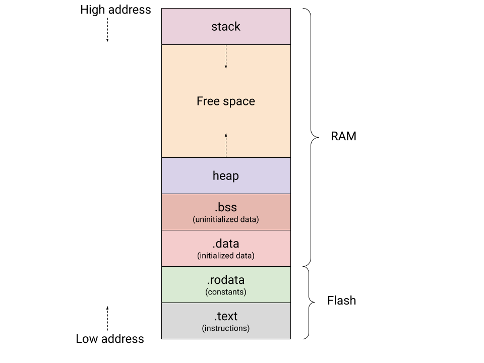
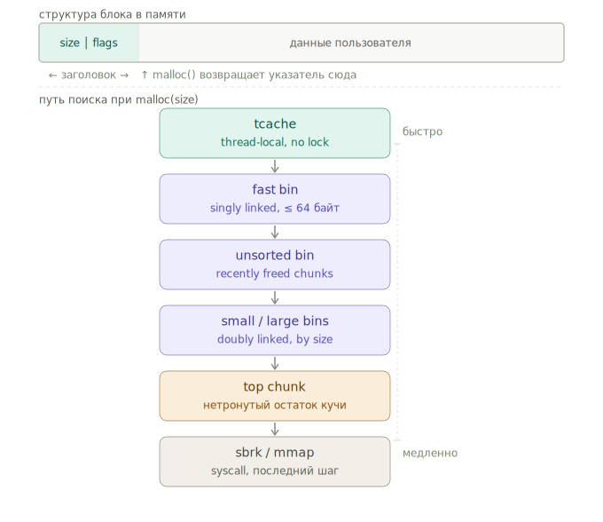

## Динамическая память

Стек и глобальные секции требуют знать размер данных на этапе компиляции.
Динамическая память позволяет выделять буферы произвольного размера в рантайме
и управлять их временем жизни вручную. Платой за это является ручное освобождение
и целый класс ошибок: утечки, двойной free, use-after-free.

## Системный вызов sbrk

Куча — это область виртуальной памяти, которая начинается сразу после секций `.bss`
и расширяется вверх. Граница кучи называется program break. Системный вызов `brk`
устанавливает её в конкретный адрес, `sbrk` сдвигает на заданное число байт.



```c
#include <unistd.h>

void *sbrk(intptr_t increment);  // сдвинуть program break на increment байт
int   brk(void *addr);           // установить program break в addr
```

`sbrk` — это обёртка над системным вызовом `brk`. `sbrk(0)` возвращает текущее
значение program break без изменений. При положительном `increment` память
добавляется, при отрицательном — возвращается ОС. Физические страницы RAM при этом
не выделяются сразу — ядро только расширяет виртуальное адресное пространство.
Реальные страницы назначаются лениво при первом обращении (demand paging).

```c
#include <unistd.h>
#include <stdio.h>

int main(void) {
    void *start = sbrk(0);
    printf("program break: %p\n", start);

    char *p = sbrk(1024);
    if (p == (void *)-1) {
        perror("sbrk");
        return 1;
    }
    printf("allocated at: %p\n", p);
    printf("new break: %p\n", sbrk(0));

    sbrk(-1024);
    return 0;
}
```

На практике `sbrk` используется только внутри аллокаторов — прямой вызов из
прикладного кода приводит к конфликту с `malloc`, который тоже управляет program break.
Современные аллокаторы для больших выделений используют `mmap` вместо `sbrk`.

## malloc и free

Стандартная библиотека предоставляет аллокатор поверх `sbrk`/`mmap`, который
управляет пулом памяти и позволяет выделять и освобождать блоки произвольного размера.

```c
#include <stdlib.h>

void *malloc(size_t size);  // выделить size байт, содержимое не определено
void  free(void *ptr);      // освободить блок, выделенный malloc/calloc/realloc
```

`malloc` возвращает `NULL` при ошибке выделения — всегда проверяй результат.
Указатель `void *` неявно приводится к любому типу указателя.

```c
char *buf = (char*) malloc(256);
if (!buf) {
    perror("malloc");
    return 1;
}

buf[0] = 'h';
buf[1] = 'i';
buf[2] = '\0';

free(buf);
// buf = NULL;  // хорошая практика — избегает use-after-free
```

После `free` указатель становится висячим (dangling pointer) — обращение к нему UB.
Повторный `free` одного и того же указателя — тоже UB, обычно приводит к краше.

## calloc

`calloc` выделяет память для массива из `nmemb` элементов по `size` байт каждый
и гарантирует обнуление всего блока.

```c
void *calloc(size_t nmemb, size_t size);
```

```c
int *arr = calloc(100, sizeof(*arr));  // 100 нулевых int
if (!arr) { /* handle */ }

int *arr2 = malloc(100 * sizeof(*arr2));
memset(arr2, 0, 100 * sizeof(*arr2));
```

`calloc` отдельно принимает количество и размер именно чтобы проверить переполнение
при умножении!

## realloc

`realloc` изменяет размер ранее выделенного блока. Если новый размер больше,
содержимое старого блока сохраняется, лишние байты не определены.

```c
void *realloc(void *ptr, size_t size);
```

Главная ловушка — никогда не записывать результат обратно в тот же указатель.
При ошибке `realloc` возвращает `NULL`, но старый блок не освобождает — это утечка.

```c
// НЕПРАВИЛЬНО — при ошибке теряем ptr
ptr = realloc(ptr, new_size);

// ПРАВИЛЬНО
void *tmp = realloc(ptr, new_size);
if (!tmp) {
    perror("realloc");
    free(ptr);
    return;
}
ptr = tmp;
```

`realloc(NULL, size)` работает как `malloc(size)`. `realloc(ptr, 0)` —
implementation-defined.

## Безопасное выделение памяти

Нестандартная, но распространённая функция, которая безопасно проверяет переполнение
при умножении перед вызовом `realloc`:

```c
size_t total;
if (__builtin_mul_overflow(nmemb, sizeof(arr->ptr[0]), &total)) {
    // переполнение — не вызывать realloc
}
void *tmp = realloc(ptr, total);
```

## Динамический массив

Классический паттерн: массив с отдельными полями `size` (занято) и `capacity`
(выделено). При переполнении ёмкость удваивается — амортизированная стоимость
одного `append` остаётся O(1).

```c
struct DynArray {
    size_t size;
    size_t capacity;
    int *ptr;
};

void append(struct DynArray *arr, int value) {
    if (arr->size + 1 > arr->capacity) {
        size_t newcap = 2 * (arr->capacity + 1);
        size_t total;
        if (__builtin_mul_overflow(newcap, sizeof(*arr->ptr), &total)) {
            perror("overflow");
            return;
        }
        int *tmp = realloc(arr->ptr, total);
        if (!tmp) {
            perror("realloc");
            return;
        }
        arr->ptr = tmp;
        arr->capacity = newcap;
    }
    arr->ptr[arr->size++] = value;
}
```

## Как устроен malloc внутри

`malloc` не обращается к ОС при каждом вызове. Вместо этого glibc реализует
аллокатор ptmalloc, который управляет пулом уже полученной памяти и переиспользует
освобождённые блоки через набор внутренних структур — bins.

Каждый выделенный блок предваряется заголовком (size word), в котором хранится
размер блока и флаги. Это позволяет `free` восстановить метаданные по одному
лишь указателю на данные: заголовок лежит ровно на `sizeof(header)` байт ниже.

При запросе `malloc(size)` ptmalloc обходит источники в строго определённом порядке:



**tcache** — приватный кэш каждого потока, не требует блокировок. Делит
выделения на size classes с шагом 16 байт (16, 32, 48, … до 1008).
При `free` небольшой блок сначала попадает сюда, при следующем `malloc` того же
размера память выдается почти мгновенно!

**fast bins** — однонаправленные списки для блоков до ~64 байт. Тоже быстрые,
но разделяются между потоками и требуют блокировки.

**unsorted bin** — временное хранилище для недавно освобождённых блоков, которые
не влезли в tcache или fastbins. Перед тем как переместить блок в small/large bin,
glibc пытается слить его с соседними свободными блоками (coalescing). Иначе при сценарии выделения большого кол-ва маленьких объектов а потом их освобождения, вся память фрагментировалась (хотя она свободная) и мы получим NULL.

**small и large bins** — двунаправленные списки для блоков крупнее fastbins.

Вот как выглядит заполненный кусок памяти
```text
┌─────────────────────────┐
│ prev_size               │ ← размер ПРЕДЫДУЩЕГО chunk │                         │   (coalescing)
├─────────────────────────┤
│ size │A│M│P│            │  ← размер этого chunk 
│ ├─64 bits──┤            │  + 3 флага в младших битах
│                         │
├─────────────────────────┤  ← malloc() возвращает
│ some data               │  указатель сюда
└─────────────────────────┘
```

Три флага: P — предыдущий chunk занят, M — этот chunk получен через mmap, A — chunk не из main arena.

Вот освобожденный (или пустой изначально)

```text
┌─────────────────────────┐
│ prev_size               │ ← размер ПРЕДЫДУЩЕГО chunk │                         │   (coalescing)
├─────────────────────────┤
│ size             │A│M│P││  ← размер этого chunk 
│                         │  + 3 флага в младших битах
│                         │
│ fd  (forward pointer)   │  ← следующий free chunk в bin
├─────────────────────────┤
│ bk  (back pointer)      │  ← предыдущий free chunk в bin
├─────────────────────────┤
│ ...                     │
└─────────────────────────┘
```


Small bins хранят блоки одного размера, large bins покрывают диапазон размеров.
Small bins - от 32 до 1008 байт с шагом 16 байт.
Large bins — от 1024 байт и выше. Каждый large bin покрывает диапазон размеров, и чем крупнее блоки — тем шире диапазон

**top chunk** — нетронутый остаток кучи в самом конце. Если все bins пусты,
top chunk разрезается: нужный кусок отдаётся пользователю, остаток остаётся top chunk.

Если и top chunk не хватает — вызывается `sbrk` для небольших выделений (до ~128 КБ)
или `mmap` для больших. Блок, полученный через `mmap`, помечается флагом `IS_MMAPED`
и при `free` сразу возвращается ОС через `munmap` — не попадает ни в какой bin.

## Выравнивание адресов
 
Аллокатор обязан возвращать адреса, выровненные минимум на размер машинного слова
(8 байт на 64-битной системе), иначе доступ к невыровненным данным — UB или
аппаратная ошибка на некоторых архитектурах.
 
Округление вверх до кратного 8 через битовую маску:
 
```c
#define ALIGN8(x) (((x) + 7) & ~7)
```
 
Как это работает: `~7` — это `...11111000` в битовом представлении. Умножение на
эту маску обнуляет три младших бита — то есть округляет вниз. Прибавление 7 перед
этим гарантирует округление вверх.
 
```c
ALIGN8(0)  == 0
ALIGN8(1)  == 8
ALIGN8(7)  == 8
ALIGN8(8)  == 8
ALIGN8(9)  == 16
ALIGN8(15) == 16
ALIGN8(16) == 16
```
 
Это нужно при написании собственного аллокатора: размер блока запрашиваемый у ОС
всегда округляется вверх, чтобы следующий заголовок тоже лежал по выровненному адресу.
 
## uintptr_t для арифметики над указателями
 
Иногда нужно сравнивать указатели или работать с ними как с числами — например
чтобы проверить попадает ли адрес в диапазон аллокации. Для этого есть `uintptr_t`
из `<stdint.h>` — беззнаковое целое того же размера что и указатель.
 
```c
#include <stdint.h>
 
bool points_into(void *ptr, void *base, size_t size) {
    uintptr_t p = (uintptr_t) ptr;
    uintptr_t b = (uintptr_t) base;
    return p >= b && p - b <= size;
}
```
 
Прямая арифметика над `void *` или `int *` — UB если указатели из разных объектов.
Каст через `uintptr_t` позволяет делать целочисленные сравнения корректно.
 
Проверка выравнивания указателя:
 
```c
bool is_aligned(void *ptr, size_t align) {
    return ((uintptr_t) ptr % align) == 0;
}
```
 
## Связный список и паттерн с двойным указателем
 
Удаление узла из односвязного списка наивно не работает — функция получает указатель
на узел, но не может обновить предыдущий `next`:
 
```c
void remove_bad(struct List *list, int key) {
    while (list && list->data != key) {
        list = list->next;  // локальная копия, не меняет предыдущий next
    }
    if (!list) {
        return;
    }
    free(list);
    list = list->next;  // use-after-free + никто не обновит предыдущий next
}
```
 
Решение — передавать указатель на указатель. Тогда `list` — это адрес поля `next`
в предыдущем узле (или адрес головы списка). Запись в `*list` обновляет именно его:
 
```c
struct List {
    int data;
    struct List *next;
};
 
void remove(struct List **list, int key) {
    while (*list && (*list)->data != key) {
        list = &(*list)->next;  // list теперь указывает на next предыдущего узла
    }
    if (!*list) {
        return;
    }
    struct List *next = (*list)->next;
    free(*list);
    *list = next;  // обновляет предыдущий next или голову списка
}
```

## Типичные ошибки

**Утечка памяти** — блок выделен, но `free` никогда не вызван. Программа потребляет
всё больше памяти с течением времени.

```c
void leak(void) {
    char *p = malloc(100);
    // free(p) забыли — 100 байт потеряны до завершения программы
}
```

**Use-after-free** — обращение к памяти после `free`. Содержимое блока может быть
уже перезаписано следующим `malloc`.

```c
char *p = malloc(64);
free(p);
p[0] = 'x';  // UB — блок уже вернули аллокатору
```

**Double free** — повторный вызов `free` для одного и того же указателя. Портит
внутренние структуры аллокатора, обычно краш или молчаливое повреждение данных.

```c
char *p = malloc(64);
free(p);
free(p);  // UB
```

**Buffer overflow на куче** — запись за пределы выделенного блока. Портит заголовок
соседнего блока или его данные.

```c
char *p = malloc(8);
strcpy(p, "hello world");  // 12 байт в 8-байтный буфер — UB
```

## Инструменты для поиска ошибок

AddressSanitizer — смотрит на исполнение кода во время компиляции и обнаруживает
use-after-free, buffer overflow, double free и утечки с точным указанием места, но при этом 2-3х падение перфа + отказ от оптимизаций:

```bash
gcc -fsanitize=address -g myprog.c -o myprog
./myprog
```

Valgrind — запускает программу в виртуальной машине и отслеживает все обращения
к памяти. Не требует перекомпиляции, но замедляет выполнение примерно до 75%

```bash
valgrind --leak-check=full ./myprog
```

## Полезные ссылочки: 
https://cs341.cs.illinois.edu/coursebook/Malloc

https://danluu.com/malloc-tutorial/

https://cmmon.medium.com/chow-does-a-malloc-work-45ba5a6fbf32

https://johnnysswlab.com/the-price-of-dynamic-memory-allocation/

### Для дз по utf-8

https://tonsky.me/blog/unicode/


