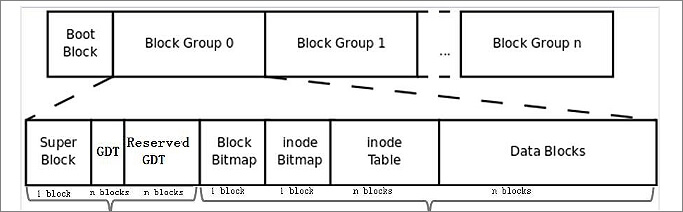
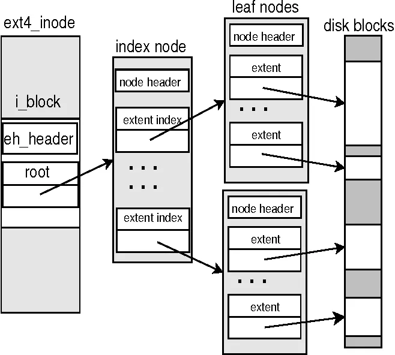
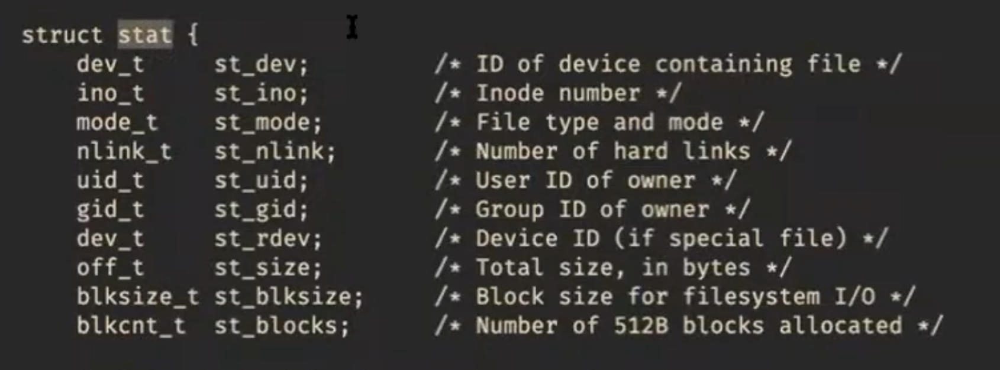

# Семинар 6 — ОС, IO, Файловая система

## 1. Операционная система — зачем она нужна

ОС — программное обеспечение, которое организует доступ к ресурсам компьютера:

- **Унифицирует** — драйверы, файловая система (одинаковый интерфейс для разных устройств)
- **Разделяет** — вытесняющая многозадачность, виртуальная память
- **Разграничивает** — права доступа для разных пользователей

```
 Прикладные программы (Ring 3, user space)
 Системные утилиты

────────────────────────────────────────────────
 Ядро ОС (Ring 0, kernel space)
```

Процессор поддерживает привилегированный режим: Ring 0 (ядро) имеет доступ к железу, служебным регистрам и служебным инструкциям. Ring 3 (пользователь) — только инструкции и регистры общего назначения.

Текущий уровень привилегий (CPL) хранится в двух младших битах регистра `cs`.

---

## 2. Системные вызовы (Linux x86_64)

Осуществляются инструкцией `syscall`. В `rax` — номер вызова, аргументы в `rdi`, `rsi`, `rdx`, `r10`, `r8`, `r9`. Результат возвращается в `rax`. Регистры `rcx` и `r11` затираются.

Все про них, с начала их инициализаций в ядре: 
https://0xax.gitbook.io/linux-insides/summary/syscall/linux-syscall-1

```c
long long result, arg1, arg2, arg3;
asm volatile("syscall"
    : "=a"(result)
    : "a"(SYS_...),
      "D"(arg1), "S"(arg2), "d"(arg3)
    : "rcx", "r11", "memory");
```

Пример — программа, делающая `exit` без libc:

```asm
#include <sys/syscall.h>
.intel_syntax noprefix

.global _start

.section .rodata
msg:
    .ascii "Hello from syscall!\n"
    .set msg_len, . - msg

.section .text
_start:
    mov eax, SYS_write
    mov edi, 1
    lea rsi, msg[rip]
    mov edx, msg_len
    syscall

    mov eax, SYS_exit_group
    xor edi, edi
    syscall
```

```
gcc -static -nostdlib bare.S -o bare
```

Документация: `man 2 <имя_вызова>`.

---

## 4. Файлы — главная абстракция UNIX

Файл — последовательность байт с доступом через файловые операции (системные вызовы).

Примеры того, что является файлом: обычный файл на диске, вывод программы, пользовательский ввод, `/dev/urandom` (бесконечная последовательность случайных байт), `/dev/sda` (весь диск), и т.д. Даже процессы представляются ввиде файлов в `/proc/`!

### Файловая позиции

```
    ──────────────────────────
... Mary had a little lamb, its ...
    ──────────────────────────
          ▲ file position

read(5) → "a lit"     (позиция сдвигается на 5)
write(5, " wolf")      (перезаписывает 5 байт с текущей позиции)
lseek(-3, SEEK_CUR)   (отматываем 3 байта назад)
```

**EOF** (End Of File)— это не символ, а ситуация: `read` вернул 0 байт.

---

## 5. Файловые дескрипторы

Целое число — индекс в таблице дескрипторов процесса. У каждого процесса таблица своя. (Все можно найти )

Стандартные дескрипторы:

| fd | Константа | Назначение |
|----|-----------|------------|
| 0  | `STDIN_FILENO`  | Стандартный ввод  |
| 1  | `STDOUT_FILENO` | Стандартный вывод |
| 2  | `STDERR_FILENO` | Стандартный поток ошибок |

Перенаправление в shell:
- `./prog > out.txt` — stdout в файл
- `./prog < in.txt` — файл в stdin
- `./prog 2> err.txt` — stderr в файл

---

## 6. POSIX File API

### read / write

```c
#include <unistd.h>

ssize_t read(int fd, void *buf, size_t count);
ssize_t write(int fd, const void *buf, size_t count);
```

Ключевые моменты:
- Читают/пишут с текущей позиции, продвигая её
- **Не гарантируют** чтение/запись всего запрошенного объёма за один вызов
- При ошибке возвращают `-1` и выставляют `errno`
- `read` возвращает `0` при EOF
- `ssize_t` — знаковый `size_t`

### Пример: простейший cat

```c
#include <unistd.h>

int main() {
    char c;
    while (read(STDIN_FILENO, &c, sizeof(c)) > 0) {
        write(STDOUT_FILENO, &c, sizeof(c));
    }
}
```

### open / close

```c
#include <fcntl.h>

int open(const char *pathname, int flags);
int open(const char *pathname, int flags, mode_t mode);
int close(int fd);
```

Флаги доступа: `O_RDONLY`, `O_WRONLY`, `O_RDWR`.
Дополнительные флаги (комбинируются через `|`):

| Флаг | Действие |
|------|----------|
| `O_CREAT` | Создать файл, если не существует (нужен `mode`) |
| `O_TRUNC` | Обрезать файл до размера 0 |
| `O_APPEND` | Позиция записи — в конец файла |

Вы юзер, как вам можно понять, есть ли у вас права на чтение или запись?

```
6    6    6
rwx  rw-  rw-
│    │    └── others: read + write
│    └─────── group:  read + write
└──────────── owner:  read + write + execute
```

### Пример: cat из файла

```c
int main(int argc, char *argv[]) {
    char buf[4096];
    int fd = open(argv[1], O_RDONLY);
    ssize_t n;
    while ((n = read(fd, buf, sizeof(buf))) > 0) {
        write(STDOUT_FILENO, buf, n);
    }
    close(fd);
}
```

### lseek

```c
off_t lseek(int fd, off_t offset, int whence);
```

| whence | Точка отсчёта |
|--------|---------------|
| `SEEK_SET` | Начало файла |
| `SEEK_CUR` | Текущая позиция |
| `SEEK_END` | Конец файла |

### Пример: узнать размер файла

```c
off_t get_file_size(const char *path) {
    int fd = open(path, O_RDONLY);
    off_t size = lseek(fd, 0, SEEK_END);
    close(fd);
    return size;
}
```

### Важно: всегда проверяйте возвращаемые значения

```c
int fd = open(path, O_RDONLY);
if (fd < 0) {
    perror(path);
    return EXIT_FAILURE;
}
```

`perror` печатает текстовое описание ошибки из `errno`.

---

## 7. Стандартная библиотека C (stdio.h) vs POSIX

stdio.h — переносимая обёртка с буферизацией поверх POSIX.

```c
FILE *fopen(const char *pathname, const char *mode);
int fclose(FILE *stream);
int fprintf(FILE *stream, const char *format, ...);
int fscanf(FILE *stream, const char *format, ...);
int fseek(FILE *stream, long offset, int whence);
int fflush(FILE *stream);
```

Режимы `fopen`:

| mode | Описание |
|------|----------|
| `"r"` | Чтение |
| `"r+"` | Чтение и запись |
| `"w"` | Запись (создать/обрезать) |
| `"w+"` | Чтение и запись (создать/обрезать) |
| `"a"` | Append (запись в конец) |
| `"a+"` | Чтение и append |

Стандартные потоки: `stdin`, `stdout`, `stderr`. `printf(...)` ≡ `fprintf(stdout, ...)`.

А как это выглядит в ASM?

FOPEN:
```asm
mov    eax, 257            ; __NR_openat = 257 (number of syscall)
mov    edi, -100            ; AT_FDCWD (текущая директория)
lea    rsi, [rel filename]  ; "test.txt"
mov    edx, 0x241           ; O_WRONLY | O_CREAT | O_TRUNC
mov    r10d, 0644o          ; file mode (permissions)
syscall
; rax = fd или отрицательный errno
```

WRITE:
```asm
mov    eax, 1              ; __NR_write = 1 (number of syscall)
mov    edi, 3              ; fd
lea    rsi, [rel buffer]   ; указатель на данные
mov    edx, 13             ; длина
syscall
; rax = количество записанных байт
```

### Буферизация

stdio буферизует вывод — данные не попадают в файл сразу. Виды буферизации:
- **Полная** (обычные файлы) — сброс при заполнении буфера или `fclose`/`fflush`
- **Построчная** (`stdout`, если TTY) — сброс при `\n`
- **Без буфера** (`stderr`) — каждый символ сразу

```c
FILE *f = fopen("out.txt", "w");
fprintf(f, "data");
// Если убить процесс сейчас — данные потеряются!
fflush(f);  // Принудительный сброс буфера
fclose(f);  // fclose тоже сбрасывает буфер
```

Kernel буферизация (page cache)

Когда write syscall доходит до ядра, данные попадают не на диск, а в page cache — ядро помечает страницу как dirty и возвращает управление. Реальная запись на диск происходит позже (pdflush/writeback thread, по умолчанию ~30 секунд или при нехватке памяти).

Флаг, который это отключает — `O_DIRECT`:

```c
int fd = open("file", O_WRONLY | O_CREAT | O_DIRECT, 0644);
```

Данные идут мимо page cache прямо на устройство. Но есть требования: буфер должен быть выровнен по размеру сектора (обычно 512 байт), и размер записи тоже.

### exit vs _exit

```c
void exit(int status);   // сбрасывает буферы stdio, вызывает atexit-хуки
void _exit(int status);  // немедленное завершение, буферы НЕ сбрасываются
```

---

## 8. Файловая система

### Иерархическая структура

Директории, корневая директория `/`, записи `.` (текущая) и `..` (родительская), абсолютные и относительные пути.

# Файловая система

## Иерархическая ФС

* Директории
* Корневая директория
* Особые записи `.` и `..`
* Абсолютные и относительные пути

## ФС на устройстве хранения (ext4)

* Устройства хранения — блочные





* Монтирование

### **Системный вызов stat**

```c
int stat(const char *pathname, struct stat *statbuf); // stat - структура с информацией о файле
```



Введя в терминал `stat filename`, можем получить информацию о размере файла, количестве блоков в нем, размере одного блока, времени доступа и др.

## **Разные типы файлов**

- Обычные файлы (regular) - последовательности байт
- Директории, в которых лежат другие файлы (в том числе директории)
- Символические ссылки
- Каналы (fifo)
- Сокеты
- Блочные устройства. Например, диск, куда можно писать блоками
- Символьные устройства. Например, терминал, куда можно читать и писать по одному символу

На Inode есть reference counter, показывающий, сколько имен ссылаются на это
содержимое. Когда reference counter = 0, ОС удаляет файл. Если открыть файл, то
его reference counter на это время увеличится.

```c
int stat(const char *file_name, struct stat *buf);
int lstat(const char *pathname, struct stat *statbuf);
int fstat(int fd, struct stat *statbuf); // Для работы с открытым файлом с помощью файлового дескриптора, а не пути
int unlink(const char *pathname); // Удаляет связь с Inode. Если pathname - последнее имя, которое указывало на Inode, то Inode удалится
```

Утилита: `stat filename` — размер, права, inode, время доступа.

### Работа с директориями

```c
#include <dirent.h>

DIR *opendir(const char *name);
struct dirent *readdir(DIR *dirp);  // NULL при конце
int closedir(DIR *dirp);
```

Пример: свой `ls`:

```c
#include <dirent.h>
#include <stdio.h>

int main(int argc, char *argv[]) {
    DIR *d = opendir(argv[1]);
    struct dirent *ent;
    while ((ent = readdir(d))) {
        printf("%s/%s\n", argv[1], ent->d_name);
    }
    closedir(d);
}
```

## 10. Полезные утилиты

- `strace ./prog` — показывает все системные вызовы программы
- `man 2 read` — документация на системный вызов
- `stat file` — информация о файле (inode, размер, права)
- `xxd file | head` — hex-дамп файла
- `od -A x -t x1z file` — ещё один hex-дамп
- `file myfile` — определить тип файла
- `ls -li` — показать inode-номера

---

## 11. Частые ошибки

1. **Не проверять возвращаемое значение** `open`, `read`, `write` — всегда проверяйте на возвращаемое значение
2. **Считать, что `read`/`write` обрабатывают весь буфер** — нужен цикл дозаписи
3. **Забыть `close(fd)`** — утечка дескрипторов (лимит ~1024)
4. **Забыть `fflush`/`fclose`** перед критическими операциями — данные останутся в буфере stdio
