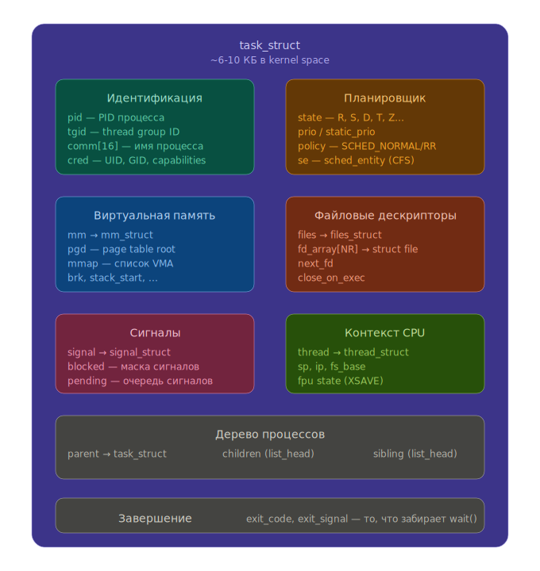

# Процессы

## Что такое процесс?

*Процесс* — это запись в таблице процессов )) в памяти ядра.
У процесса есть:
* числовой идентификатор (`PID`, process ID);
* собственное пространство виртуальной памяти;
* таблица файловых дескрипторов;
* параметры для планировщика.

Любая программа, которую мы написали и запустили, выполняется в созданном для неё процессе.

## Планировщик

Планировщик (scheduler) — компонент ядра, выбирающий, какую задачу исполнять следующей.

Ключевые метрики:
* *Fairness* — каждый процесс должен получать справедливую долю CPU;
* *Latency* — время отклика на действия пользователя;
* *Throughput* — общее количество полезной работы в единицу времени;
* *Starvation* — ситуация, когда процесс бесконечно долго не получает CPU.

Планировщик Linux (CFS — Completely Fair Scheduler) достаточно «честный»,
приоритизирует IO-bound задачи, использует стандартную квоту в несколько миллисекунд,
старается не перемещать задачи между ядрами без необходимости
и отделяет «обычные» задачи от задач реального времени.

## Переключение контекста

### Добровольное вытеснение

Процесс сам отдаёт CPU, например:
* выполняет IO (read/write блокируется);
* вызывает `sleep`;
* блокируется на мьютексе;
* вызывает `sched_yield`.

### Принудительное вытеснение

Ядро отбирает CPU у процесса:
* по таймеру (истёк timeslice);
* по аппаратному прерыванию.

### Стоимость переключения

Явные затраты: сохранение и восстановление регистров, обновление метрик в ядре,
выбор следующего процесса.

Косвенные затраты: потеря «разогретости» — портятся кэши данных (cache locality),
состояние branch predictor'а и TLB cache (при переключении между процессами с разными
адресными пространствами).

## Команда `ps` и утилиты мониторинга

    $ ps aux     # информация о запущенных процессах

* Опция `a` — вывести процессы всех пользователей (привязанных к терминалу).
* Опция `x` — вывести процессы без управляющего терминала (демоны, фоновые задачи).
* Опция `u` — расширенный формат (CPU, MEM, время старта и т.д.).
* Опция `e` — вывести все процессы.
* Опция `f` — полноформатный список с деревом.

Полезные утилиты: `htop`/`top` — интерактивный мониторинг,
`pstree` — дерево процессов в системе.

## Файловая система `/proc` (procfs)

`/proc` — виртуальная (псевдо-)файловая система.
Содержимое генерируется ядром на лету.

    $ ls /proc        # каталоги с числовыми именами = PID процессов
    $ cat /proc/self/status   # информация о текущем процессе

Полезные файлы внутри `/proc/<PID>/`:
* `status` — имя, состояние, UID/GID, использование памяти;
* `stat` — сырая строка для парсинга (состояние, приоритет, и т.д.);
* `cmdline` — командная строка запуска;
* `fd/` — каталог с символическими ссылками на открытые файловые дескрипторы;
* `maps` — отображения виртуальной памяти;
* `task/` — потоки (threads) процесса;
* `cwd` — ссылка на текущий рабочий каталог.



## Статусы процесса

Поле STAT в выводе `ps` указывает на состояние процесса:
* `R` — running/runnable, исполняется или готов к исполнению;
* `S` — sleeping (interruptible), ожидает возвращения из системного вызова;
* `T` — stopped, остановлен пользователем (например, `Ctrl+Z` / `SIGSTOP`);
* `Z` — zombie, процесс завершился, но родитель не забрал статус через `wait`;
* `t` — остановлен отладчиком (traced);
* `D` — uninterruptible sleep, обычно ожидание дискового IO.

## Как породить новый процесс? — `fork`

```c
#include <unistd.h>

pid_t fork(void);
```

`fork` создаёт *копию* вызывающего процесса. Копируется (логически) вся виртуальная
память (на практике используется copy-on-write), а также таблица файловых дескрипторов.

Возвращаемое значение:
* в **родительском** процессе — `PID` дочернего процесса;
* в **дочернем** процессе — `0`;
* при ошибке — `-1`.

Из этого следует, что PID процессов начинаются с `1`. (почти)

### Базовый пример

```c
#include <unistd.h>
#include <stdio.h>

int main() {
    pid_t pid = fork();
    if (pid == 0) {
        printf("child %d\n", getpid());
    } else {
        printf("parent %d\n", getpid());
    }
}
```

Порядок выполнения родительского и дочернего процессов **не определён**.

### Виртуальная память после `fork`

Хотя виртуальные адреса одинаковы, пространства памяти — отдельные:

```c
#include <unistd.h>
#include <stdio.h>

int x = 0;

int main() {
    fork();
    ++x;
    sleep(1); // для надёжности
    printf("x = %d, &x = %p\n", x, &x);
}
```

**OUTPUT:**
```
x = 1, &x = 0x55f9
x = 1, &x = 0x55f9
```

Адреса совпадают (виртуальные!), но значения независимы.

### Буферизация stdout и `fork`

```c
int main() {
    printf("hello\n");
    fork();
}
```

Если stdout идёт в терминал, `\n` сбрасывает буфер — `hello` напечатается один раз.
Но если stdout перенаправлен в файл (full buffering), буфер **скопируется** при `fork`,
и `hello` может появиться дважды!

**Вывод:** перед `fork` стоит делать `fflush(stdout)` или использовать небуферизированные
write-вызовы.

## Полезные системные вызовы

### `sleep` — подождать N секунд

```c
unsigned int sleep(unsigned int seconds);
```

### `pause` — ждать до получения сигнала

```c
int pause(void);
```

### `wait` / `waitpid` — дождаться завершения дочернего процесса

```c
pid_t wait(int *wstatus);
pid_t waitpid(pid_t pid, int *wstatus, int options);
```

`wait` блокирует выполнение, пока не завершится **любой** из дочерних процессов.
`waitpid` позволяет указать конкретный PID (или `-1` для любого).

Макросы для анализа статуса:
* `WIFEXITED(wstatus)` — true, если процесс завершился нормально (через `exit` или `return` из `main`);
* `WEXITSTATUS(wstatus)` — код возврата (имеет смысл только если `WIFEXITED` вернул true);
* `WIFSIGNALED(wstatus)` — true, если процесс был убит сигналом;
* `WTERMSIG(wstatus)` — номер сигнала, убившего процесс.

### `kill` — убить процесс

```c
int kill(pid_t pid, int sig);
```

Отправляет сигнал sig процессу с идентификатором pid. Несмотря на название, kill не обязательно убивает процесс — это зависит от конкретного сигнала. Например, SIGTERM (15) просит процесс завершиться (процесс может перехватить и обработать), а SIGKILL (9) завершает принудительно — его невозможно перехватить, заблокировать или проигнорировать.

./binary < in.txt

## Зомби и сироты

**Zombie** — дочерний процесс завершился, но родитель ещё не вызвал `wait`.
Процесс остаётся в таблице процессов (состояние `Z`), чтобы родитель мог
забрать его exit-статус.

**Orphan** — родитель завершился раньше дочернего процесса.
Происходит *reparenting* — осиротевший процесс перепривязывается к `PID 1` (init/systemd)
или к ближайшему *subreaper*'у (процесс, пометивший себя через
`prctl(PR_SET_CHILD_SUBREAPER, 1)`).

Пример — родитель завершается раньше:

```c
#include <unistd.h>
#include <stdio.h>

int main() {
    pid_t id = fork();
    if (id == 0) {
        printf("child process\n");
        sleep(2);
    } else {
        printf("parent process\n");
    }
    printf("Hello there\n");
}
```

Здесь родитель печатает `"parent process"`, `"Hello there"` и завершается.
Дочерний процесс становится сиротой, печатает `"child process"`, спит 2 секунды,
печатает `"Hello there"` и завершается. При этом промпт шелла может появиться
**до** вывода дочернего процесса.

## Таблица файловых дескрипторов и `fork`

При вызове `open`:
1. Создаётся `struct file` (file description) в ядре.
2. В таблицу file descriptors процесса добавляется указатель на эту структуру.
3. Индекс в таблице возвращается как файловый дескриптор.

При `fork` таблица файловых дескрипторов **копируется**, но обе копии
указывают на **одни и те же** `struct file` в ядре. Это значит:

* **`fork`** — у дочернего процесса те же fd, указывающие на те же file descriptions. Счётчики ссылок увеличиваются.
* **`close`** — закрывает fd только в таблице текущего процесса, уменьшает счётчик ссылок.
* **`lseek`** — меняет позицию в `struct file`, а значит **влияет на оба процесса**.
* **`read`/`write`** — позиция чтения/записи **общая** для процессов, разделяющих file description.

```c
int main() {
    FILE *file = fopen("out.txt", "w");
    int pid = fork();
    if (pid == 0) {
        fprintf(file, "child\n");
    } else {
        fprintf(file, "parent\n");
    }
}
```

В `out.txt` может оказаться как `"parent\nchild\n"`, так и `"child\nparent\n"`,
или даже перетёртые данные, потому что позиция записи общая через `struct file`,
но при этом каждый процесс имеет **свой** stdio-буфер (копия памяти при `fork`).

## Атомарность

### Проблема неатомарной проверки

```c
// Процесс 1
fd = open("A", O_RDONLY, 0);
if (fd < 0 && errno == ENOENT) {
    fd = open("A", O_WRONLY | O_CREAT, 0600);
}
```

Между проверкой на существование и созданием файла может вклиниться
другой процесс и создать свой файл с тем же именем (TOCTOU race condition).

**Решение:** использовать флаг `O_EXCL` — `open("A", O_WRONLY | O_CREAT | O_EXCL, 0600)`.
Тогда `open` атомарно проверит отсутствие файла и создаст его, вернув ошибку `EEXIST`,
если файл уже существует.

Через `fopen` аналогично: `fopen("out.txt", "wx")`.

### Атомарность `write`

POSIX **не гарантирует** атомарности операций `write`/`read`.
Теоретически результатом одновременных `write("123")` и `write("abc")` из разных
процессов может быть `"1a2b3c"`.

Однако Linux на практике гарантирует атомарность отдельных `write` для обычных файлов.

Для атомарной записи в конец файла используйте флаг `O_APPEND` — он делает
перемещение позиции в конец и запись **одной атомарной операцией**.

## Семейство системных вызовов `exec*`

`exec` замещает тело текущего процесса новой программой:
* PID **не меняется**;
* создаётся новое пространство виртуальной памяти;
* в неё загружается указанный бинарный файл и начинается его исполнение.

Варианты:

```c
int execl(const char *path, const char *arg, ...);         // список аргументов, полный путь
int execlp(const char *file, const char *arg, ...);        // список аргументов, поиск по PATH
int execle(const char *path, const char *arg, ..., char *const envp[]); // + окружение
int execv(const char *path, char *const argv[]);           // массив аргументов, полный путь
int execvp(const char *file, char *const argv[]);          // массив аргументов, поиск по PATH
int execvpe(const char *file, char *const argv[], char *const envp[]); // + окружение
```

Мнемоника: `l` = list (аргументы через запятую), `v` = vector (массив),
`p` = PATH (поиск по `$PATH`), `e` = environment (передача окружения).

### Важно:

Если `exec` завершился успешно, код **после** него никогда не выполнится,
потому что процесс уже исполняет другую программу:

```c
int main() {
    execlp("ls", "ls", "-la", NULL);
    perror("Error");  // выполнится только если execlp завершился с ошибкой
}
```

### Типичный паттерн: `fork` + `exec` + `wait`

```c
int main() {
    pid_t child = fork();
    if (child == 0) {
        execlp("ls", "ls", "-la", NULL);
        _exit(127);  // если exec не сработал — завершаем дочерний процесс
    }
    int status;
    wait(&status);
    printf("Child exited with %d\n", WEXITSTATUS(status));
}
```

**Почему `_exit`, а не `exit`?** В дочернем процессе после неудачного `exec`
не нужно выполнять `atexit`-обработчики и сбрасывать stdio-буферы
(они общие с родителем через `fork`). `_exit` завершает процесс немедленно.

## `dup` / `dup2` — дублирование файловых дескрипторов

```c
int dup(int oldfd);                  // создаёт копию fd на наименьший свободный номер
int dup2(int oldfd, int newfd);      // делает newfd копией oldfd (если newfd открыт — закрывает его)
```

### Пример: перенаправление stdout в файл

```c
pid_t child = fork();
if (child == 0) {
    int fd = open("output.txt", O_WRONLY | O_CREAT | O_TRUNC, 0666);
    dup2(fd, STDOUT_FILENO);  // теперь stdout пишет в файл
    close(fd);                // закрываем лишний дескриптор
    execlp("ls", "ls", "-la", NULL);
    _exit(127);
}
wait(NULL);
```

Это в точности то, что делает шелл при выполнении `ls -la > output.txt`.