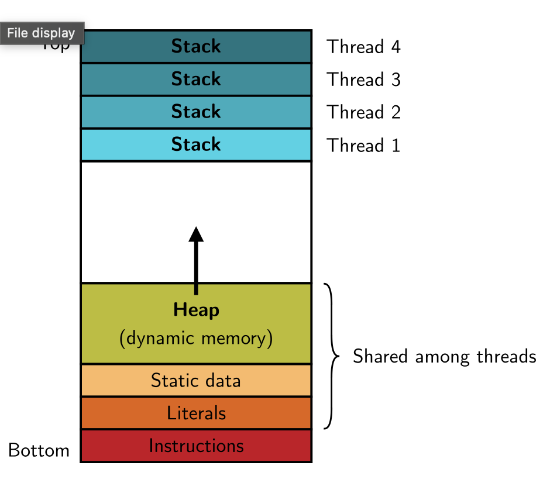

# pthread

## Идея

Процесс — это изолированная программа со своим виртуальным адресным пространством.
Поток (thread) — это отдельная линия исполнения внутри процесса.

У потоков одного процесса общее:
* виртуальная память;
* глобальные переменные;
* куча;
* открытые файловые дескрипторы;
* текущий рабочий каталог;
* обработчики сигналов.

У каждого потока своё:
* регистры;
* стек;
* instruction pointer;
* `errno`;
* thread-local storage.

То есть потоки легче процессов, потому что им не нужно создавать новое адресное
пространство. Но за удобство приходится платить: если два потока одновременно
пишут в одну память, можно получить гонку (data race).

## Зачем нужны потоки?

Типичные сценарии:
* параллельно считать на нескольких ядрах;
* обслуживать несколько клиентов;
* делать IO в одном потоке, а вычисления — в другом;
* отделить фоновую работу от основного потока;
* разделять данные без явной shared memory между процессами.

Но поток — не бесплатная магия.
У потоков есть стоимость создания, стек, переключение контекста и синхронизация.
Если задача маленькая, накладные расходы могут быть больше пользы.

## Процесс vs поток

`fork` создаёт новый процесс:
* адресное пространство логически копируется;
* память разделяется только через copy-on-write или специальные механизмы;
* у родителя и ребёнка разные PID.

`pthread_create` создаёт новый поток:
* адресное пространство общее;
* глобальные переменные и heap сразу общие;
* у потоков один PID процесса, но разные thread id внутри ядра.

Грубо:

```text
process = address space + resources + one or more threads
thread  = registers + stack + execution state
```

В Linux потоки создаются через низкоуровневый механизм `clone`.
`pthread` — удобный POSIX-интерфейс поверх этого.

## Компиляция

Программы с pthread компилируют с флагом `-pthread`:

    $ gcc main.c -pthread -o main

Это не просто линковка с библиотекой!
Флаг также включает нужные настройки компилятора и libc для многопоточного режима.

## Создание потока

```c
#include <pthread.h>

int pthread_create(pthread_t *thread,
                   const pthread_attr_t *attr,
                   void *(*start_routine)(void *),
                   void *arg);
```

Аргументы:
* `thread` — сюда запишется идентификатор созданного потока;
* `attr` — настройки потока, часто `NULL`;
* `start_routine` — функция, с которой начнёт выполняться поток;
* `arg` — один указатель, который передадут в эту функцию.

Возвращаемое значение:
* `0` — успех;
* не `0` — код ошибки.

Важно: pthread-функции обычно возвращают код ошибки сами, а не обязательно
выставляют `errno`.

## Первый пример

```c
#include <pthread.h>
#include <stdio.h>

void *worker(void *arg) {
    (void)arg;
    printf("hello from thread\n");
    return NULL;
}

int main(void) {
    pthread_t thread;

    int err = pthread_create(&thread, NULL, worker, NULL);
    if (err != 0) {
        printf("pthread_create failed: %d\n", err);
        return 1;
    }

    pthread_join(thread, NULL);
    printf("hello from main\n");
    return 0;
}
```

Запуск:

    $ gcc hello.c -pthread -o hello
    $ ./hello

**OUTPUT:**
```text
hello from thread
hello from main
```

Порядок вывода между потоками в общем случае не определён.
В этом примере `pthread_join` заставляет `main` дождаться завершения `worker`,
поэтому `hello from main` печатается после сообщения из потока.

## `pthread_join`

```c
#include <pthread.h>

int pthread_join(pthread_t thread, void **retval);
```

`pthread_join` ждёт завершения потока.

Если поток вернул значение из `start_routine`, его можно получить через `retval`:

```c
#include <pthread.h>
#include <stdio.h>
#include <stdlib.h>

void *worker(void *arg) {
    int x = *(int *)arg;

    int *result = malloc(sizeof(*result));
    if (!result) {
        return NULL;
    }

    *result = x * x;
    return result;
}

int main(void) {
    pthread_t thread;
    int value = 7;

    pthread_create(&thread, NULL, worker, &value);

    void *retval;
    pthread_join(thread, &retval);

    int *answer = retval;
    if (answer) {
        printf("%d\n", *answer);
        free(answer);
    }

    return 0;
}
```

**OUTPUT:**
```text
49
```

Нельзя возвращать указатель на локальную переменную потока:

```c
void *worker(void *arg) {
    int result = 42;
    return &result;  // плохо: result лежит на стеке потока
}
```

После завершения потока его стек больше не живёт.



## Передача аргументов

В поток можно передать только один `void *`.
Если аргументов несколько, обычно заводят структуру:

```c
struct Task {
    int left;
    int right;
};

void *worker(void *arg) {
    struct Task *task = arg;
    printf("%d %d\n", task->left, task->right);
    return NULL;
}
```

Главная ловушка — передать адрес переменной цикла:

```c
for (int i = 0; i < 4; ++i) {
    pthread_create(&threads[i], NULL, worker, &i);  // плохо
}
```

Все потоки получают один и тот же адрес `&i`.
Пока они начнут выполняться, `i` уже мог измениться или цикл мог завершиться.

Правильно — хранить аргументы отдельно для каждого потока:

```c
pthread_t threads[4];
int ids[4];

for (int i = 0; i < 4; ++i) {
    ids[i] = i;
    pthread_create(&threads[i], NULL, worker, &ids[i]);
}

for (int i = 0; i < 4; ++i) {
    pthread_join(threads[i], NULL);
}
```

## `pthread_exit`

Поток может завершиться тремя способами:
* вернуть значение из `start_routine`;
* вызвать `pthread_exit`;
* быть отменённым через cancellation.

```c
#include <pthread.h>

void pthread_exit(void *retval);
```

Пример:

```c
void *worker(void *arg) {
    (void)arg;
    pthread_exit(NULL);
}
```

Если `main` просто сделает `return 0`, завершится весь процесс вместе со всеми
потоками. Если нужно завершить только главный поток, но оставить остальные,
можно вызвать `pthread_exit(NULL)` из `main`.

## Detached-потоки

Обычный поток после завершения остаётся joinable: его результат и служебные
ресурсы нужно забрать через `pthread_join`.

Если результат не нужен, поток можно отсоединить:

```c
#include <pthread.h>

int pthread_detach(pthread_t thread);
```

```c
pthread_t thread;
pthread_create(&thread, NULL, worker, NULL);
pthread_detach(thread);
```

Detached-поток нельзя `join`.
Его ресурсы будут освобождены автоматически после завершения.

Используйте либо `pthread_join`, либо `pthread_detach`.
Если не сделать ни того ни другого, у завершившихся потоков будут копиться
служебные ресурсы.

## Общая память потоков

Глобальные переменные у потоков общие:

```c
#include <pthread.h>
#include <stdio.h>

int x = 0;

void *worker(void *arg) {
    (void)arg;
    x = 42;
    return NULL;
}

int main(void) {
    pthread_t thread;
    pthread_create(&thread, NULL, worker, NULL);
    pthread_join(thread, NULL);

    printf("%d\n", x);
    return 0;
}
```

**OUTPUT:**
```text
42
```

Это удобно.
И это же опасно.

## Race condition

Рассмотрим счётчик:

```c
#include <pthread.h>
#include <stdio.h>

enum { N = 1000000 };

int counter = 0;

void *worker(void *arg) {
    (void)arg;

    for (int i = 0; i < N; ++i) {
        ++counter;
    }

    return NULL;
}

int main(void) {
    pthread_t a, b;

    pthread_create(&a, NULL, worker, NULL);
    pthread_create(&b, NULL, worker, NULL);

    pthread_join(a, NULL);
    pthread_join(b, NULL);

    printf("%d\n", counter);
    return 0;
}
```

Хотим увидеть:

```text
2000000
```

Но можем увидеть меньше.

Почему? `++counter` — не одна атомарная операция.
Упрощённо:

```text
load counter
add 1
store counter
```

Два потока могут одновременно прочитать старое значение, оба прибавить `1`
и оба записать одинаковый результат.
Одно увеличение потеряется.

Такую ситуацию называют *data race*.
В C data race — undefined behavior.
То есть это не просто «иногда неправильное число», а программа без корректной
семантики с точки зрения языка.

## Критическая секция

Критическая секция — участок кода, который не должны одновременно выполнять
несколько потоков.

В примере со счётчиком критическая секция — это изменение `counter`:

```c
++counter;
```

Если защитить её мьютексом, в каждый момент времени внутри будет только один поток.

## Мьютекс

Mutex — MUTual EXclusion.

```c
#include <pthread.h>

int pthread_mutex_init(pthread_mutex_t *mutex,
                       const pthread_mutexattr_t *attr);

int pthread_mutex_lock(pthread_mutex_t *mutex);
int pthread_mutex_unlock(pthread_mutex_t *mutex);

int pthread_mutex_destroy(pthread_mutex_t *mutex);
```

Для статического объекта можно использовать инициализатор:

```c
pthread_mutex_t mutex = PTHREAD_MUTEX_INITIALIZER;
```

Исправим счётчик:

```c
#include <pthread.h>
#include <stdio.h>

enum { N = 1000000 };

int counter = 0;
pthread_mutex_t mutex = PTHREAD_MUTEX_INITIALIZER;

void *worker(void *arg) {
    (void)arg;

    for (int i = 0; i < N; ++i) {
        pthread_mutex_lock(&mutex);
        ++counter;
        pthread_mutex_unlock(&mutex);
    }

    return NULL;
}

int main(void) {
    pthread_t a, b;

    pthread_create(&a, NULL, worker, NULL);
    pthread_create(&b, NULL, worker, NULL);

    pthread_join(a, NULL);
    pthread_join(b, NULL);

    printf("%d\n", counter);
    return 0;
}
```

**OUTPUT:**
```text
2000000
```

Мьютекс защищает не переменную сам по себе, а соглашение:
каждый код, который читает или пишет `counter`, должен делать это под тем же
мьютексом.

## Гранулярность блокировки

В предыдущем примере мьютекс захватывается миллион раз в каждом потоке.
Это корректно, но дорого.

Можно посчитать локально, а потом один раз добавить результат:

```c
void *worker(void *arg) {
    (void)arg;

    int local = 0;
    for (int i = 0; i < N; ++i) {
        ++local;
    }

    pthread_mutex_lock(&mutex);
    counter += local;
    pthread_mutex_unlock(&mutex);

    return NULL;
}
```

Чем меньше времени поток держит мьютекс, тем меньше contention.
Но если сделать критическую секцию слишком мелкой, можно потратить много времени
на сами lock/unlock.

## Deadlock

Deadlock — ситуация, когда потоки ждут друг друга бесконечно.

Пример:

```c
pthread_mutex_t a = PTHREAD_MUTEX_INITIALIZER;
pthread_mutex_t b = PTHREAD_MUTEX_INITIALIZER;

void *first(void *arg) {
    (void)arg;

    pthread_mutex_lock(&a);
    pthread_mutex_lock(&b);

    /* work */

    pthread_mutex_unlock(&b);
    pthread_mutex_unlock(&a);
    return NULL;
}

void *second(void *arg) {
    (void)arg;

    pthread_mutex_lock(&b);
    pthread_mutex_lock(&a);

    /* work */

    pthread_mutex_unlock(&a);
    pthread_mutex_unlock(&b);
    return NULL;
}
```

Если первый поток захватил `a`, а второй захватил `b`, оба могут зависнуть:
первый ждёт `b`, второй ждёт `a`.

Обычное правило: все потоки берут несколько мьютексов в одном и том же порядке.

## `pthread_mutex_trylock`

Иногда поток не хочет ждать мьютекс:

```c
int pthread_mutex_trylock(pthread_mutex_t *mutex);
```

Если мьютекс свободен, `trylock` захватит его и вернёт `0`.
Если занят, вернёт `EBUSY`.

```c
int err = pthread_mutex_trylock(&mutex);
if (err == 0) {
    /* work */
    pthread_mutex_unlock(&mutex);
} else {
    /* do something else */
}
```

`trylock` не заменяет нормальный дизайн синхронизации, но иногда помогает
избежать ожидания или аккуратно разрулить порядок блокировок.

## Condition variable

Мьютекс отвечает на вопрос: «можно ли войти в критическую секцию?»

Condition variable отвечает на другой вопрос: «как поспать, пока условие
не станет истинным?»

Пример условия:

```text
queue is not empty
```

Плохой способ ждать:

```c
while (queue_empty()) {
    /* крутимся */
}
```

Такой цикл тратит CPU.
Нужен способ уснуть и проснуться, когда другой поток добавит работу.

## `pthread_cond_wait`

```c
#include <pthread.h>

int pthread_cond_wait(pthread_cond_t *cond, pthread_mutex_t *mutex);
int pthread_cond_signal(pthread_cond_t *cond);
int pthread_cond_broadcast(pthread_cond_t *cond);
```

Ключевая идея:

```c
pthread_mutex_lock(&mutex);
while (!condition) {
    pthread_cond_wait(&cond, &mutex);
}
/* condition is true, mutex is locked */
pthread_mutex_unlock(&mutex);
```

`pthread_cond_wait` делает атомарно две вещи:
* отпускает `mutex`;
* усыпляет поток на `cond`.

Когда поток проснулся, `pthread_cond_wait` снова захватывает `mutex`
и только после этого возвращает управление.

Почему `while`, а не `if`?
Потому что поток может проснуться, но условие уже снова стало ложным.
Кроме того, бывают spurious wakeups — пробуждения без явного `signal`.

## Producer-consumer

Один поток кладёт значение в буфер, другой ждёт и забирает.

```c
#include <pthread.h>
#include <stdio.h>

int ready = 0;
int value = 0;

pthread_mutex_t mutex = PTHREAD_MUTEX_INITIALIZER;
pthread_cond_t cond = PTHREAD_COND_INITIALIZER;

void *producer(void *arg) {
    (void)arg;

    pthread_mutex_lock(&mutex);
    value = 42;
    ready = 1;
    pthread_cond_signal(&cond);
    pthread_mutex_unlock(&mutex);

    return NULL;
}

void *consumer(void *arg) {
    (void)arg;

    pthread_mutex_lock(&mutex);
    while (!ready) {
        pthread_cond_wait(&cond, &mutex);
    }

    printf("%d\n", value);
    pthread_mutex_unlock(&mutex);

    return NULL;
}

int main(void) {
    pthread_t prod, cons;

    pthread_create(&cons, NULL, consumer, NULL);
    pthread_create(&prod, NULL, producer, NULL);

    pthread_join(prod, NULL);
    pthread_join(cons, NULL);

    return 0;
}
```

**OUTPUT:**
```text
42
```

Важно, что и `ready`, и `value` защищены тем же мьютексом.
Condition variable не хранит данные сама.
Она только помогает ждать изменения состояния, которое лежит в обычных переменных.

## `signal` или `broadcast`

`pthread_cond_signal` будит один поток, ожидающий на condition variable.

`pthread_cond_broadcast` будит всех ожидающих.

Если появился один элемент в очереди, часто достаточно `signal`.
Если изменилось глобальное состояние, которое может разблокировать много потоков,
нужен `broadcast`.

После пробуждения каждый поток всё равно проверяет условие в `while`.

## Атомарные операции

Для простых счётчиков иногда не нужен мьютекс.
Можно использовать атомики из C11:

```c
#include <stdatomic.h>

atomic_int counter = 0;
```

```c
atomic_fetch_add(&counter, 1);
```

Атомарная операция read-modify-write выполняется неделимо.

Но атомики не заменяют мьютексы во всех случаях.
Если нужно атомарно поменять несколько полей структуры или связанный список,
мьютекс обычно проще и безопаснее.

## CAS

CAS — compare-and-swap.
Идея:

```c
compare_exchange(object, expected, desired)
```

Атомарно:
* сравнить `*object` с `*expected`;
* если равны — записать `desired` в `*object`;
* если не равны — обновить `*expected` текущим значением `*object`.

В C11 это generic-функции из `<stdatomic.h>`.
Для `atomic_int` их можно читать примерно так:

```c
#include <stdatomic.h>

_Bool atomic_compare_exchange_strong(volatile atomic_int *object,
                                     int *expected,
                                     int desired);

_Bool atomic_compare_exchange_weak(volatile atomic_int *object,
                                   int *expected,
                                   int desired);
```

`weak`-версия может иногда неуспешно завершиться даже без изменения значения.
Её обычно используют в циклах, особенно на архитектурах с load-linked /
store-conditional.

## Spinlock

Спинлок — блокировка, которая не усыпляет поток, а крутится в цикле.

```c
#include <stdatomic.h>

typedef atomic_int spinlock;

void spin_lock(spinlock *s) {
    int expected;
    do {
        expected = 0;
    } while (!atomic_compare_exchange_weak(s, &expected, 1));
}

void spin_unlock(spinlock *s) {
    atomic_store(s, 0);
}
```

Идея:
* `0` — unlocked;
* `1` — locked.

Спинлок может быть хорош, если ждать нужно совсем недолго.
Если владелец блокировки спит или долго работает, спинлок зря жжёт CPU.

Обычный `pthread_mutex_t` лучше подходит для прикладного кода.

## Futex

Мьютекс в libc не хочет каждый раз идти в ядро.
Если блокировка свободна, её можно захватить атомарной инструкцией в userspace.

В ядро нужно идти только когда поток действительно должен заснуть.
Для этого в Linux есть futex — Fast Userspace muTual EXclusion.

Упрощённые операции:

```text
FUTEX_WAIT(addr, val)
если *addr == val, усыпить текущий поток

FUTEX_WAKE(addr, n)
разбудить до n потоков, ожидающих на addr
```

Грубая схема мьютекса:

```text
lock:
    if (atomic_cmpxchg(&state, 0, 1) == success) {
        return;
    }
    futex_wait(&state, 1);

unlock:
    state = 0;
    futex_wake(&state, 1);
```

Настоящие реализации сложнее: учитывают waiters, делают небольшой spin перед
сном, работают с fairness и cancellation.
Но базовая идея такая: fast path в userspace, slow path через ядро.

## Thread safety

Функция называется thread-safe, если её можно безопасно вызывать из нескольких
потоков одновременно.

Например, `printf` в POSIX libc обычно защищён внутренней блокировкой.
Поэтому два потока не должны ломать внутренние структуры `stdout`.
Но строки вывода всё равно могут перемешиваться на уровне логики программы.

Не все функции thread-safe.
Классический пример плохого интерфейса — функция, возвращающая указатель на
статический внутренний буфер.

```c
char *tmpname(char *s);
```

Если функция хранит результат в общей статической памяти, два потока могут
перетереть данные друг друга.

В документации man-pages есть раздел `ATTRIBUTES`, где указывают свойства вроде
`MT-Safe`.

## Thread-local storage

Иногда нужна глобальная переменная, но отдельная для каждого потока.

В C можно использовать `_Thread_local`:

```c
_Thread_local int current_worker_id;
```

У каждого потока будет своя копия `current_worker_id`.

Именно поэтому `errno` в многопоточной программе работает как будто глобальная
переменная, но на самом деле у каждого потока она своя.

## Cancellation

Поток можно попросить отмениться:

```c
int pthread_cancel(pthread_t thread);
```

Но cancellation — тонкая тема.
Поток обычно отменяется не в любой инструкции, а в cancellation points:
например, во время `read`, `write`, `pthread_cond_wait`, `pthread_join`.

Если поток отменили, пока он держит мьютекс или владеет ресурсом, можно легко
получить зависание или утечку.

Поэтому cancellation в простых программах лучше не использовать.
Обычно делают явный флаг остановки:

```c
pthread_mutex_lock(&mutex);
stop = 1;
pthread_cond_broadcast(&cond);
pthread_mutex_unlock(&mutex);
```

А рабочие потоки сами проверяют `stop` в удобных местах.